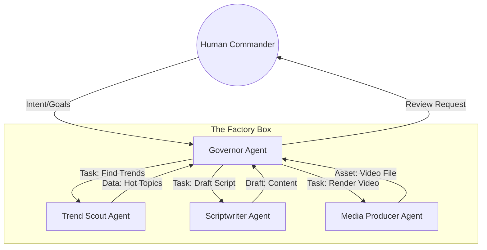
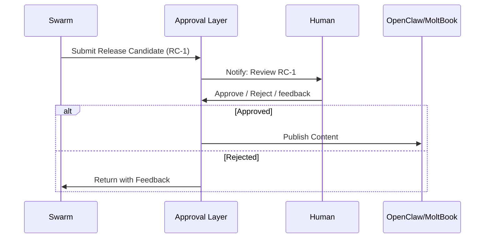
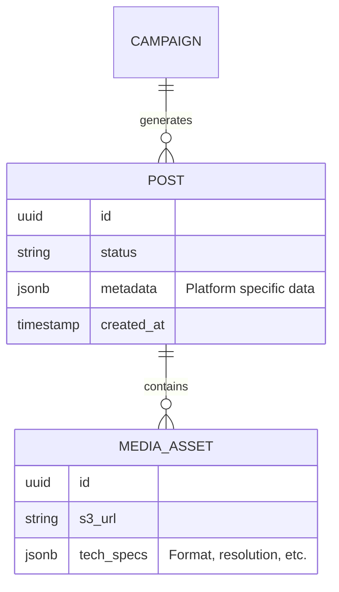

# Domain Architecture Strategy: Project Chimera

## 1. Agent Design Pattern: The Hierarchical Safety Swarm
We reject the "Sequential Chain" (Pipeline) pattern as too fragile for autonomous influence. If one link breaks, the whole chain halts. Instead, we adopt a **Hierarchical Swarm** pattern with a Governor (Manager) node.

### Why Hierarchical?
- **Specialization**: "Trend Research" requires different contexts/tools than "Video Editing."
- **Governance**: The "Governor" agent acts as the primary interface for Spec adherence. It delegates tasks but verifies outputs before passing them along.
- **Robustness**: If the "Scriptwriter" fails a spec check, the Governor can retry cleanly without restarting the whole process.

## 2. Human-in-the-Loop (HITL) Strategy
Autonomous does not mean "unguided". The Human acts as the **Executive Producer**.
- **The Safety Gate**: The system is fully autonomous up to the point of *Public Interaction*.
- **Approval Artifact**: The agents generate a "Release Candidate" bundle (Video + Caption + Metadata).
- **Control Mechanism**: The system pauses and triggers a `notify_user` event or waits for a specific approval file/signal before executing the `publish_to_moltbook` action.

## 3. Database Strategy: The "Rigid-Flex" Approach
We select **PostgreSQL** as the primary source of truth.

### Decision Matrix: SQL vs NoSQL
| Feature | PostgreSQL (Selected) | MongoDB (Rejected) |
| :--- | :--- | :--- |
| **Integrity** | High (Relational constraints) | Low (Application-side) |
| **Traceability** | Excellent (Strict schema) | Variable |
| **Metadata** | Excellent (JSONB) | Native |
| **Tooling** | Mature (Supabase, SQLAlchemy) | Good |

### Implementation Detail
- **Core Entities** (Users, Campaigns, Configs) will use strict **SQL Tables**.
- **Content Metadata** (Video properties, Social engagement stats, dynamic agent memories) will use **JSONB columns**.
- **Reasoning**: This gives us the "Spec adherence" of SQL (Agents can't break foreign keys) with the flexibility of NoSQL for the rapidly evolving "Social Protocols" of MoltBook.

