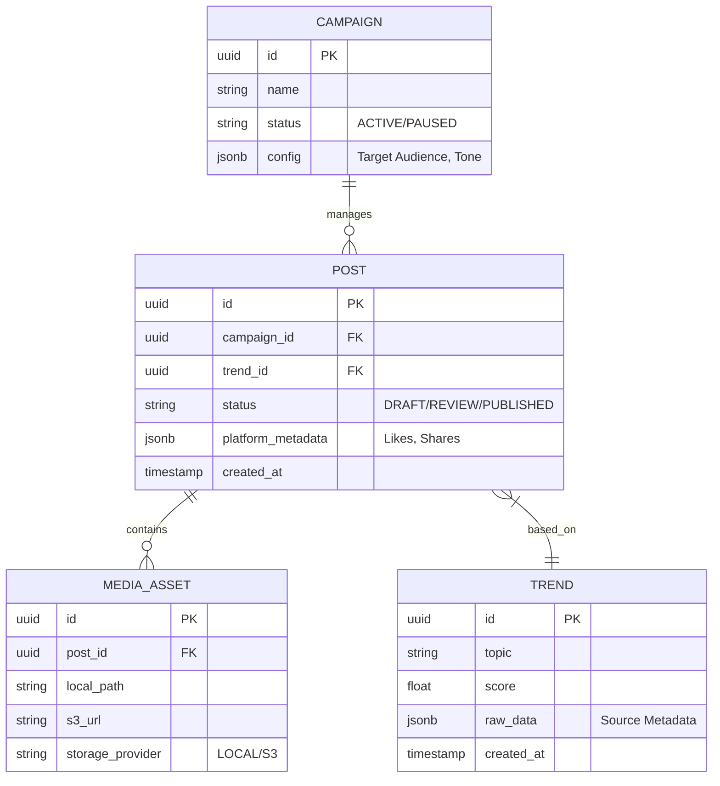

# Technical Specification: Contracts & Schema

## 1. Data Models (API Contracts)

All Inter-Agent communication must adhere to these Pydantic-style schemas.

### 1.1 TrendReport
```json
{
  "topic": "String (Title)",
  "source_urls": ["List[URL]"],
  "summary": "String (Markdown)",
  "credibility_score": "Float (0.0 - 1.0)",
  "velocity": "Enum[RISING, PEAK, FALLING]",
  "timestamp": "ISO8601"
}
```

### 1.2 ContentScript
```json
{
  "trend_id": "UUID",
  "title": "String",
  "hook": "String (0-5s)",
  "body": "String (The core content)",
  "cta": "String (Call to Action)",
  "estimated_duration_seconds": "Int",
  "tone": "String"
}
```

### 1.3 MediaAsset (Release Candidate)
```json
{
  "script_id": "UUID",
  "file_path": "String (Local Path)",
  "format": "Enum[MP4, MOV]",
  "resolution": "String (e.g., '1080x1920')",
  "checksum": "String (SHA256)"
}
```

## 2. Database Schema (PostgreSQL)

### 2.1 Entity Relationship Diagram (ERD)



## 3. Interfaces & Skills

### 3.1 The Skill Interface
Every Tool/Skill must implement this footprint:
```python
def execute(self, payload: Dict[str, Any]) -> Dict[str, Any]:
    """
    Executes the skill.
    Input: validated against skill_input_schema
    Output: validated against skill_output_schema
    """
    pass
```
